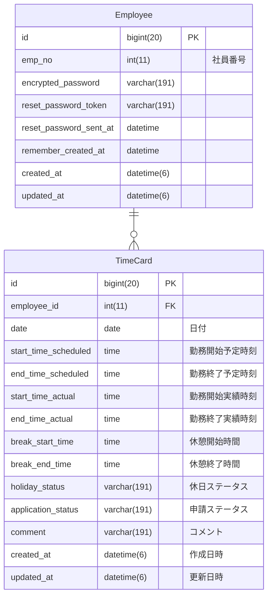
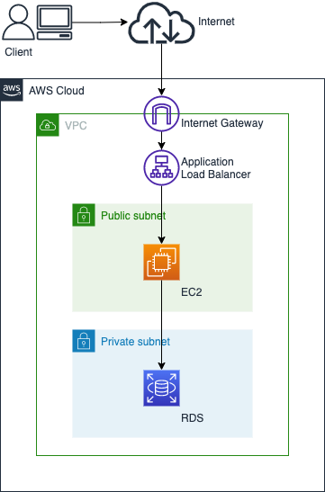

# ブラウザ作業自動化サービス 『Automiser』

## 概要
社内で利用している勤怠管理アプリへの勤怠入力の手間を削減するブラウザ作業自動化サービスです。  
勤怠管理アプリへ登録されている勤務予定データを取り込み、そのデータを勤務実績データとして登録します。  

## URL
### https://automiser.net/

## 機能一覧
| No. | 機能         |
| --- | ---------- |
| 1   | ユーザー機能     |
| 2   | 勤務予実取得機能   |
| 3   | 勤務実績手動修正機能   |
| 4   | 勤務実績自動登録機能 |

## 使用技術
- ### フロントエンド
  - #### HTML/CSS、Tailwind CSS
- ### バックエンド
  - #### Ruby、Rails
- #### インフラ
  - #### AWS（VPC、Route53、 ACM、ALB、EC2、RDS）
  - #### MySQL
  - #### Ubuntu

## ER図

## インフラ構成図

